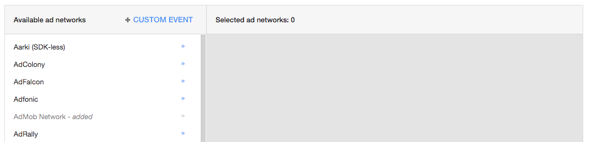
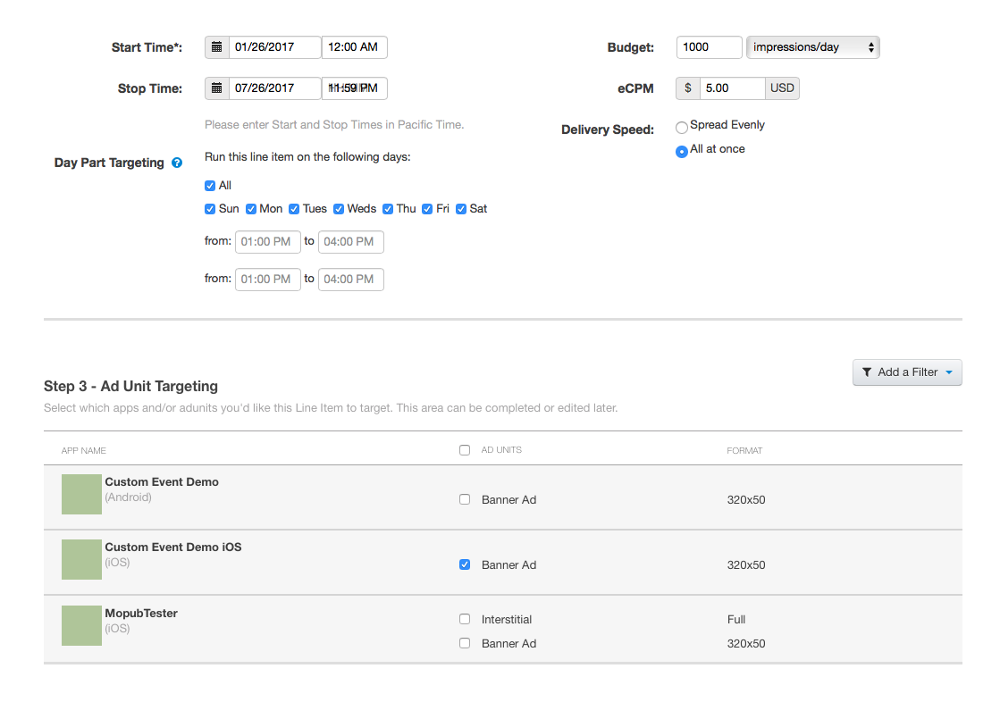

# GroundTruth Display SDK - iOS

## Updates in version 1.1.5
1. Support traffic source setting for report purpose, please go to stand alone integration part for detail;
2. Set `label` in DFP/Admob config as traffic source ([DFP instruction](#user-content-label-dfp) & [Admob instruction](#user-content-label-admob));
3. Fixed a bug which can cause not rendering creative when creative contains both doubleverify js & celtra js;

## Table of Contents

[Overview](#user-content-overview)

[Integration](#user-content-integration)

Stand Alone
* [Banner](#user-content-stand-alone-banner)
* [Interstitial](#user-content-stand-alone-interstitial)
* [Video](#user-content-stand-alone-video)

Mediation Networks
* [DFP](#user-content-dfp)
* [AdMob](#user-content-admob)
* [MoPub](#user-content-mopub)

<a name="overview"></a>
## Overview

The GroundTruth advertising network is powered by patented Location Verification and GroundTruth Blueprints™ technologies. This technology helps detect quality user location signals that then drives the delivery of high-performance ad inventory to the right user at the right time for the purpose of monetizing your Mobile App.

Mobile App publishers can access this ad inventory with the GroundTruth Display SDK. The GroundTruth Display SDK is designed to be embedded within a Mobile App. It provides the necessary modules to serve and render ads and support popular mediation networks.

This guide contains information on how to integrate your application with the GroundTruth Display SDK. It is also designed to work with popular GroundTruth mediation frameworks: DFP, Admob, and Mopub.

### Capabilities

* Support for Swift and Objective-C 
* Support for Standard Banner Ads
* Support for Interstitial Ads
* Support for MRAID v2.0 (Mobile Rich Media Ad Interface Definition)
* Support for VAST v2.0 Linear (Video Ad Serving Template)
* Mediation support to fall back on the following ad networks:
  * DFP
  * Admob
  * Mopub

### Requirements

* iOS 8+
* Publisher key provided by GroundTruth

### Data Collection

The Display SDK requires specific information to deliver the right ad to the user. Some information is collected automatically, while other information is passed in by the application. 

#### 1) Automatically collected data

* User Agent
* Location (when available)
  * Latitude
  * Longitude
  * Altitude
  * Floor
  * Horizontal accuracy
  * Vertical accuracy
* Device ID (IDFA on iOS) 
* IP address 
* Application info
  * Name
  * Bundle
  * Version
* Device info
  * Language
  * Operating system
  * Operating system version

#### 2) Application provided data

To prevent advertising specific products or services inside the App, the GroundTruth Display SDK supports blocking per `RTB` specification.

* Blocked Categories (comma delimited list of IAB codes or the products or services or companies)
* Blocked Advertisers (comma delimited list of top level domains of advertisers you want to block)

You should provide a form to collect the following information:

* Gender
* Age - We do not deliver any ads to users 13 years old or younger, and we also do not deliver any alcohol ads to users unless they are 21+
* Location - Alternative location information when you the publisher refuse to enable GPS location acquisition. You can choose to send the user’s zip code, city along with IP address which is automatically collected

##### COPPA Compliance

GroundTruth is COPPA compliant and as such we do not serve advertisements to children under the age of 13 or those who opt-out using iOS and Android Do-not-track features. Help us by collecting and sending the user age or date of birth.

<a name="integration"></a>
## Integration Instructions

### Step 1 - Request a publisher key and download Display SDK

You will be given an `access_key`. If your partner manager has not yet supplied this please send an email to sdk@groundtruth.com. Afterwards, download the GroundTruth Display SDK by adding this line into your project's podfile `pod 'GroundTruthDisplaySDK' '~> 1.1.7'`.

### Step 2 - Enable location

Giving users the option to opt-in in sharing their location data is required. GroundTruth determines the ad that is most relevant and higher peforming with location data like geo-coordinates, horizontal accuracy, and IP address.

The opt-in process involves a pop-up dialog where you can also add a message. Your application can customize the message and then invoke the dialog.

You have two options for location sharing:

1. Using Location When In Use
2. Using Location Always 

### Step 3 - Specify location opt-in messages

Add the following keys inside the `Info.plist` along with the text message shown to the user during the opt-in. 

```xml
<key>NSLocationWhenInUseUsageDescription</key>
<string>Give some good reason why the user should opt-in</string>

<key>NSLocationAlwaysAndWhenInUsageDescription</key>
<string>Give some good reason why the user should opt-in</string>
```

Warning: Choose your message carefully to convince your users of the benefits of doing so.

### Step 4 - Choose to use Display SDK as standalone or integrate with DFP/AdMob/MoPub

<a name="stand-alone"></a>
## Option 1 - Standalone

<a name="stand-alone-banner"></a>
### Banner

#### Step 1a - Add banner view to storyboard

Open an existing view controller in your storyboard and add a new `View` with the dimensions of the banners you want to display (320x50, 300x250, 320x480, 728x90).


Make sure you set the custom class attribute to `XADBannerView`.


Add a property in the Swift class called `bannerView` and bind it to the newly created view using `Control+drag`.

#### Step 1b - Add banner view programmatically

Alternatively, you can also choose instantiate and position the view programmatically by adding the following code in the `viewDidLoad` method:

```swift
let bannerView = XADBannerView(adSize:.banner, origin: CGRect(x:0,y:0))
```

#### Step 2 - Configure the banner view

```swift
let birthday: Date? = ...

self.bannerView.accessKey = "<access_key>" //required
self.bannerView.trafficSource = "<traffic_source>" //required, pick a proper name for traffi source, like `300x250_banner_home_page`
self.bannerView.autoRefreshIntervalSeconds = 30 //0 means static
self.bannerView.delegate = self // Optional
let adRequest = XADRequest(gender: .male, birthday: birthday)
self.bannerView.adRequest = adRequest //required
self.bannerView.rootViewController = self //required
```

#### Step 3 - Implement the delegate methods (Optional, and only when used as standalone)

In order to receive events from the SDK, you must implement the XADBannerDelegate.

```swift
extension ViewController: XADBannerDelegate {
    func bannerViewWillLeaveApplication(withAd ad:XADBannerView) {
        
    }
    
    func bannerViewDidFailToReceive(withAd ad: XADBannerView, withError errorCode: XADErrorCode) {
        // Occurs when there was an error retrieving ad or there was no fill
    }
}
```

#### Step 4 - Request an ad

You will need to call the `loadAd` method to tell the network layer to request an ad from the server.

```swift
self.bannerView.loadAd()
```

<a name="stand-alone-interstitial"></a>
### Interstitial

#### Step 1 - Configure the interstitial view

Interstitial ads do not require you to modify the storyboard. You will need to instantiate and position the view programmatically by adding the interstitial property to the Swift class.

```swift
let interstitial = XADInterstitial()
```

```swift
let birthday: Date? = ...

self.interstitial.accessKey = "<access_key>" //required
self.interstitial.trafficSource = "<traffic_source>" //required, pick a proper name for traffi source, like `interstitial_after_level_finished`
self.interstitial.delegate = self
let adRequest = XADRequest(gender: .male, birthday: birthday)
self.interstitial.adRequest = adRequest //required
self.interstitial.rootViewController = self //required
```

#### Step 2 - Implement the delegate methods(Only when used as standalone)

The delegate method is called when the interstitial has been loaded and is ready to display. This example calls the `showIntestitial` method as soon as it becomes available. Other uses may include pausing a game or performing some cleanup before displaying the interstitial ad.

```swift
extension ViewController: XADInterstitialDelegate {
    func interstitialDidReceiveAd(_ interstitial: XADInterstitial) {
        self.interstitial.showInterstitial()
    }
}
```

#### Step 3 - Request an ad

```swift
self.interstitial.loadAd()
```

<a name="stand-alone-video"></a>
### Video

#### Step 1 - Configure the video ad

```swift
let videoAd = XADVideoAd(vmin: 10, vmax: 60)
//vmin: minimum duration of video ad
//vmax: maximum duration of video ad
```

```swift
let birthday: Date? = ...

self.videoAd.accessKey = "<access_key>" //required
self.videoAd.trafficSource = "<traffic_source>" //required, pick a proper name for traffi source, like `video_after_level_finished`
self.videoAd.delegate = self
let adRequest = XADRequest(gender: .male, birthday: birthday)
self.videoAd.adRequest = adRequest //required
self.rootViewController = self //required
```

#### Step 2 - Implement the delegate methods(Only when used as standalone)

The delegate method is called when the video has been loaded and is ready to display. This example calls the `playVideo` method as soon as it becomes available. Other uses may include pausing a game or performing some cleanup before displaying the video ad.

```swift
extension ViewController: XADVideoAdDelegate {
    public func videoAdDidReceived(_ videoAd: XADVideoAd) {
        self.videoAd.playVideo()
    }
    
    public func videoAdFailedToReceive(withErrorCode errocCode: XADErrorCode) {
        // Occurs when there was an error retrieving ad or there was no fill
    }
}

```

#### Step 3 - Request an ad

```swift
self.videoAd.loadAd()
```

<a name="dfp"></a>
## Option 2 - DFP

### Step 1 - Add the provided DFP framework

Make sure to have the following pods:

```
pod 'GroundTruthDisplaySDK' '~> 1.1.7'
pod 'GroundTruthCustomEventForGoogleMobileAd' '~> 1.1.7'
```

Note: You may need to set `Objc Linker Flag` in `Build Settings` on XCode for intergrating DFP. Please check https://firebase.google.com/docs/ios/setup#frameworks for more details.

### Step 2 - Add GroundTruth as an Ad Network

Under the `Admin` section click `All Companies`.

Click `New Company` and select `Ad network`.


Create a new `Ad network` called GroundTruth.


### Step 3 - Create a New Order

Under the `Delivery` tab select `My Orders` and create a `New Order`.


Set `Advertiser` as GroundTruth in the order.


We recommend that you refer to Googleʼs type and priorities and network documents in order to better understand how to configure your line items. GroundTruth custom events will be set up as a network line item and it will be in consideration along with AdSense and Ad Exchange.

Make sure you set the type as NETWORK and the end time is set to UNLIMITED to keep this maintain this configuration. Set the bid price in this section with the value that was agreed upon with the GroundTruth team.


Configure the rest of the order to your specifications.

### Step 4 - Create a New Creative

Under the line item, click `New Creative`.


Select `SDK Mediation`.


Select `Custom Event` under the `Select Network` drop-down.

Set `Class Name` to `XADCustomEventForGoogleMobileAd.XADCustomEventForDFP` for banner ads or `XADCustomEventForGoogleMobileAd.XADCustomEventInterstitialForDFP` for interstitial ads.

Set `Parameter` to your GroundTruth publisher key.

<a name="label-dfp"></a>
Set `Label` to any words that best to describe this ad unit, e.g. "320x50_banner_on_home_page", GroundTruth will use it as traffice source for report purpose.

Set `Location Data` to `Active`.


### Step 5 Integrating DFP
https://developers.google.com/mobile-ads-sdk/docs/dfp/ios/banner

**Note**: If you are trying to implement Banner View Delegate methods in order to be notified when event happens like `adDidRecieved..` or `adDidFailed..`, you should use `GADBannerViewDelegate` instead of using `XADBannerViewDelegate`.

<a name="admob"></a>
## Option 3 - AdMob

### Step 1 - Add the provided AdMob framework

Make sure to have the following pods:

```
pod 'GroundTruthDisplaySDK' '~> 1.1.7'
pod 'GroundTruthCustomEventForGoogleMobileAd' '~> 1.1.7'
```

### Step 2 - Configure GroundTruth as an Ad Source

Click on `Ad Sources` under `Mediation` to view the ad source editor.


Click `+ New Add Network` to open a list of ad networks.


Click `+ Custom Event` to open the custom event editor.



Set `Class Name` to `XADCustomEventForGoogleMobileAd.XADCustomEventForAdmob` for banner ads or `XADCustomEventForGoogleMobileAd.XADCustomEventInterstitialForAdmob` for interstitial ads.

Set `Parameter` to your GroundTruth publisher key

<a name="label-admob"></a>
Set `Label` to any words that best to describe this ad unit, e.g. "320x50_banner_on_home_page", GroundTruth will use it as traffice source for report purpose.


Finally, click `Continue` and then `Save` to finalize the addition of GroundTruth as an ad source.


### Step 3 - Configure eCPM prices

Click on the `AdMob Network` and uncheck `Optimize AdMob Network` to allow GroundTruth's custom event to participate in the auction.


Enter in the agreed eCPM price, per negotiation with GroundTruth, into the eCPM column.


For this to work, the GroundTruth eCPM should ideally be higher than your default AdMob eCPM.

### Step 4 Integrating Admob
https://developers.google.com/admob/ios/banner

**Note**: If you are trying to implement Banner View Delegate methods in order to be notified when event happens like `adDidRecieved..` or `adDidFailed..`, you should use `GADBannerViewDelegate` instead of using `XADBannerViewDelegate`.

<a name="mopub"></a>
## Option 4 - MoPub

### Step 1 - Add the provided MoPub framework

Make sure to have the following pods:

```
pod 'GroundTruthDisplaySDK' '~> 1.1.7'
pod 'GroundTruthCustomEventForMopub' '~> 1.1.8'
```

### Step 2 - Add GroundTruth as a Native Network


### Step 3 - Create a New Order


### Step 4 - Create a New Line Item


Set `Type & Priority` to `Network`.

Set `Class` to `XADCustomEventForMopub.XADCustomEventForMopub` for banner ads or `XADCustomEventForMopub.XADCustomEventInterstitialForMopub`.

Set `Data` to your GroundTruth publisher key.

```
{
  "accesskey": "<access_key>", //required
  "trafficsource" : "<traffic_source>" //required, pick a proper name for traffi source, like `300x250_banner_home_page` 
}
```

### Step 5 - Set eCPM

Set the duration, the agreed budget, and the negotiated eCPM.

Select the previously created `Ad Unit` which utilizes the GroundTruth custom ad network.



Continue setting all additional parameters and save.

### Step 6 Integrating Mopub
https://www.mopub.com/resources/docs/ios-sdk-integration/integrating-banner-ads-ios/

**Note**: If you are trying to implement Banner View Delegate methods in order to be notified when event happens like `adViewDidLoadAd..` or `adViewDidFailed..`, you should use `MPAdViewDelegate` instead of using `XADBannerViewDelegate`.
